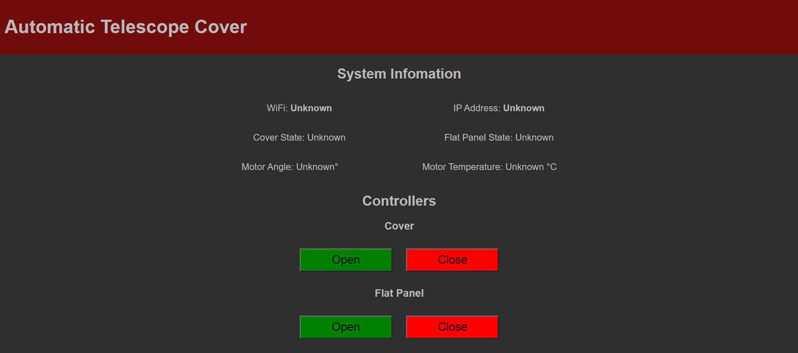

# automatic-telescope-cover
The web-controlled telescope cover with flat panel, built with ESP32 and the servo motor.

## Hardwares
* NodeMCU-32S (ESP32)
* SG-90 Servo Motor
* Electroluminescent Panel (Input 5V)
* Logic level converter

## Interface

